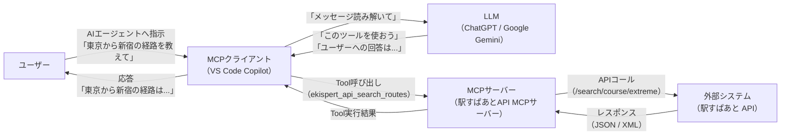
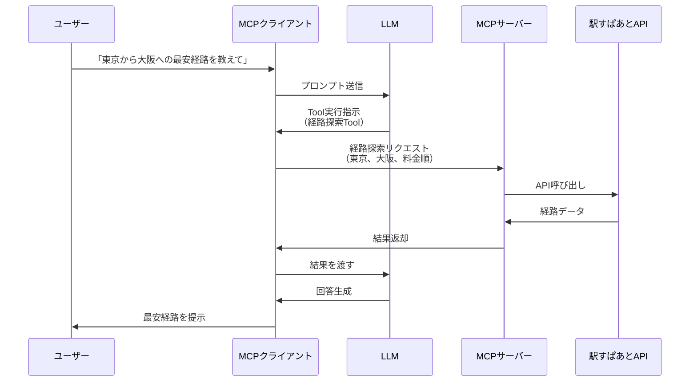

# 2. MCPサーバーとは

> **所要時間**: 20分

## このセクションの目的

このセクションでは、以下の内容を理解します。

- MCP（Model Context Protocol）の基礎を理解する
- MCPサーバーとMCPクライアントの関係を理解する
- MCPサーバーがなぜ必要なのかを理解する
- 実際のMCPサーバーの活用例を知る

---

## 2-1. MCP（Model Context Protocol）とは

### MCPの定義

**MCP（Model Context Protocol）** は、AIエージェントと外部システムをつなぐための標準化されたプロトコルです。

2024年11月にAnthropic社が提唱し、オープンソースとして公開されました。現在では、Claude Desktop、VS Code（GitHub Copilot）、その他多くのAIエージェントがMCPに対応しています。

### なぜMCPが必要なのか

MCPが登場する前も、AIエージェントと外部システムを連携させることは可能でした。 しかし、以下のような課題がありました。

1. **開発コストが高い**
   - アプリケーションごとに個別の連携コードを開発
   - アプリケーションごとに仕様を学習する必要があり、時間と学習コストがかかる

2. **保守性が低い**
   - 連携の実装方式がシステムごとにバラバラで、メンテナンスが困難だった
   - バグ修正や機能追加が他のシステムに影響しやすかった

3. **知見・資産の再利用ができない**
   - 作成した連携コードは特定のアプリケーション専用となり、使い回しができなかった
   - コミュニティでの共有や横展開がしづらかった

4. **セキュリティ対策が統一されていない**
   - 認証・認可の実装が各システムで異なり、品質にばらつきがあった
   - セキュリティのベストプラクティスが共有されず、対策が属人化しやすかった

### MCPが解決する課題とメリット

AIエージェントと外部システムを連携させる際には、個別実装や標準化の欠如といった課題がありました。 MCPはこれらの課題を、**統一されたプロトコル**を提供することで解決しています。

| メリット | 従来 | MCP |
|---|---|---|
| **開発コストと時間の削減** | サービス利用者側が開発 アプリケーションごとの仕様に合わせて連携、仕様を学習する必要 | サービス開発側がMCPサーバーを提供 利用者は統一された方法で設定するだけで使用できる |
| **既存システムの活用** | 各アプリケーションごとにカスタム連携を開発する必要があり、システム全体の作り直しが必要になることもある | 既存のデータベースや業務システムをそのまま接続でき、段階的なAI導入が可能 |
| **エコシステムによる知見の共有** | 他のアプリケーションでは使い回せず、共有しづらい | 企業や個人の開発したMCPサーバーをコミュニティで共有 使う側の活用例の共有 |
| **セキュリティ対策の標準化** | 認証・認可の方式や対策がバラバラで品質にばらつきがある | 認証・認可の仕組みやセキュリティ対策が標準化され、ベストプラクティスが共有される |
| **AIエージェントによる自律的な業務自動化** | 対話システムとしての利用が中心で、業務自動化は限定的 | コード修正やファイル操作など、実業務を自律的に遂行できる。業務プロセス全体の自動化や高度な支援が可能 |

#### AIエージェントが連携できるシステムの例

- **データベース**: 社内のデータベースから情報を取得・更新
- **WebAPI**: 外部サービスのAPIを呼び出し
- **ファイルシステム**: ローカルファイルの読み書き
- **業務システム**: ERPや在庫管理システムなど、企業固有のシステム

MCPにより、AIエージェントは個別の実装なしに多様な外部システムへアクセスしやすくなりました。 MCPのコミュニティの活用で機能を素早く拡張でき、連携できるシステムの幅が大きく広がっています。

---

## 2-2. MCPの構成要素

MCPは、**MCPクライアント**と**MCPサーバー**という2つの要素で構成されます。

### MCPクライアントとは

**MCPクライアント**は、AIエージェント側のアプリケーションです。ユーザーと対話し、必要に応じてMCPサーバーを呼び出します。

主なMCPクライアントの例は以下のとおりです。

- **VS Code + GitHub Copilot**: Microsoft社のエディタとAIコーディング支援機能
- **Claude Desktop**: Anthropic社が提供するデスクトップアプリケーション

### MCPサーバーとは

**MCPサーバー**は、APIなどの外部システムとの橋渡し役です。MCPクライアントからのリクエストを受け取り、外部システムにアクセスして結果を返します。

#### MCPサーバーが提供する機能

MCPサーバーは、以下の3種類の機能をMCPクライアントに提供できます。

| 機能 | 説明 | 例 |
|---|---|---|
| Tool（ツール） | AIエージェントが実行できる**アクション**。関数のように、パラメータを受け取り処理を実行し結果を返すもの | ・ファイルを読み込むTool ・データベースにクエリを実行するTool ・経路を検索するTool |
| Resource（リソース） | AIエージェントが参照できる**データ**。ファイルやデータベースの内容など、読み取り専用の情報 | ・プロジェクト内のファイル一覧 ・データベースのテーブル定義 ・APIのドキュメント |
| Prompt（プロンプト） | AIエージェントが利用できる**定型的な指示テンプレート**。よく使う質問や指示をあらかじめ定義したもの | ・「このコードをレビューして」 ・「このデータを分析して」 ・「エラーを修正して」 |

多くのMCPサーバーは、主に**Tool**を提供します。「駅すぱあと API MCPサーバー」も、経路探索などのToolを提供します。

### MCPクライアントとMCPサーバーの関係

**動作の流れ**

1. ユーザーがMCPクライアント（AIエージェント）に指示を出す
2. MCPクライアントがLLMで指示を解釈し、必要な処理を判断する
3. MCPクライアントがMCPサーバーにリクエストを送る
4. MCPサーバーが外部システムにアクセスし、データを取得・処理する
5. MCPサーバーが結果をMCPクライアントに返す
6. LLMが結果を分析し、ユーザー向けの回答を生成する
7. MCPクライアントがユーザーに結果を提示する

**具体例**

「駅すぱあと API MCPサーバー」の場合、以下のような流れになります。

このように、ユーザーは自然な言葉で指示するだけで、MCPクライアントが必要な処理を自動的に実行してくれます。

### MCPの通信方式

MCPサーバーとMCPクライアント間の通信には、大きく分けて以下の2つの方式があります。

| 項目 | stdio方式 | Streamable HTTP方式 |
|---|---|---|
| **概要** | 標準入出力を使った通信方式 | HTTPプロトコルを使った通信方式 |
| **動作場所** | 自分のコンピューター上（ローカル） | ローカルまたはリモート（インターネット上） |
| **起動方法** | Dockerやnpxなどでローカル起動 | HTTPサーバーとして起動 |
| **プロセス管理** | MCPクライアントが自動的に起動・管理 | 独立したサーバーとして動作 |
| **通信方法** | 標準入出力（stdin/stdout） | HTTPプロトコル |
| **認証** | 不要（ローカル実行のため） | 認証・認可の設定が必要 |
| **適している用途** | ・ローカルファイルシステムへのアクセス ・ローカルツールやコマンドの実行 ・開発環境やテスト環境での利用 ・機密性の高い操作 | ・WebAPIとの連携 ・リモートシステムやクラウドサービスへのアクセス ・複数ユーザーでの共有利用 ・企業の既存システムとの連携 |

「駅すぱあと API MCPサーバー」は、**Streamable HTTP方式**で動作します。

---

## 2-3. MCPサーバーの活用例

実際に、どのようなMCPサーバーが存在し、どのように活用されているのかを見ていきましょう。

### 公式MCPサーバー

Anthropic社は、基本的な機能を持つ公式MCPサーバーを提供しています。

#### Filesystem

**機能**: ローカルファイルシステムへのアクセス

**提供するTool**：
- ファイルの読み込み
- ファイルの書き込み
- ファイル一覧の取得
- ディレクトリ作成

**活用例**：
- 「このフォルダ内のすべてのファイルを読み込んで、エラーがないか確認して」
- 「このデータを整形して、新しいファイルに保存して」

#### Fetch

**機能**: WebサイトやWebAPIへのアクセス

**提供するTool**：
- 指定したURLからコンテンツを取得
- HTTPリクエストの送信

**活用例**：
- 「この会社のWebサイトから最新のプレスリリースを取得して」
- 「天気予報APIから今日の天気を取得して」

#### Time

**機能**: 現在時刻の取得とタイムゾーン変換

**提供するTool**：
- 現在時刻の取得
- タイムゾーン変換

**活用例**：
- 「ニューヨークの現在時刻を教えて」
- 「日本時間の15時は、ロンドンでは何時？」

#### GitHub

**機能**: GitHubリポジトリへのアクセス

**提供するTool**：
- リポジトリの検索
- ファイルの読み込み
- Issueの作成・更新
- Pull Requestの作成

**活用例**：
- 「このリポジトリのREADMEを読み込んで要約して」
- 「バグ修正のIssueを作成して」

#### その他の公式MCPサーバー

- **Memory**: AIエージェントが情報を記憶・検索
- **Brave Search**: Web検索
- **Google Drive**: Google Driveへのアクセス
- **Slack**: Slackメッセージの送受信
- **PostgreSQL**: PostgreSQLデータベースへのアクセス

### コミュニティが開発したMCPサーバー

MCPはオープンソースのため、世界中の開発者がMCPサーバーを作成・公開しています：

- **AWS管理用MCPサーバー**: AWSリソースの操作・監視
- **Notion MCPサーバー**: Notionデータベースへのアクセス
- **Spotify MCPサーバー**: 音楽の再生・検索
- **天気予報MCPサーバー**: 各種気象情報の取得
- **翻訳MCPサーバー**: 多言語翻訳

MCPサーバーの一覧は、以下のリポジトリで確認できます：
- https://github.com/modelcontextprotocol/servers

### 「駅すぱあと API MCPサーバー」の位置づけ

**「駅すぱあと API MCPサーバー」**は、「駅すぱあと API」をMCPクライアントから利用できるようにするMCPサーバーです。

**提供する機能**：
- 経路探索：出発地から目的地までの経路を検索
- 駅情報取得：駅の詳細情報を取得
- 探索条件生成：細かい条件を指定した経路探索

**特徴**：
- Streamable HTTP方式で動作
- 「駅すぱあと API」のアクセスキーで認証
- 日本の公共交通機関に特化した高精度な経路探索

**活用シーン**：
- 「東京駅から大阪駅までの最安経路を教えて」
- 「明日の朝8時に新宿駅に着くには、横浜駅を何時に出発すればいい？」
- 「新幹線を使わずに、東京から京都まで行く方法を教えて」

このハンズオンでは、この「駅すぱあと API MCPサーバー」を実際に使いながら、MCPサーバーの仕組みを体験していきます。

### MCPサーバー利用時の注意点

MCPサーバーは外部システムと連携する便利なツールですが、**業務で活用する際にはセキュリティリスクを十分に考慮する必要があります**。

このハンズオンでは時間の都合上、セキュリティの詳細には触れませんが、実際の業務でMCPサーバーを導入する際には、適切なセキュリティ対策が不可欠です。

**詳しくは、[付録：MCPサーバーのセキュリティガイド](appendix/mcp_security.md)をご覧ください。**  
業務での利用を検討される方は、必ず付録の内容を確認されることをお勧めします。

---

次のセクションからは、実際にMCPサーバーを動かしながら、その仕組みを体験していきます。

---

[← 前へ：生成AI時代とAIエージェントの基礎](01_ai_agent_basics.md) | [目次](../README.md) | [次へ：MCPサーバーを触ってみよう →](03_mcp_vscode_setup.md)
