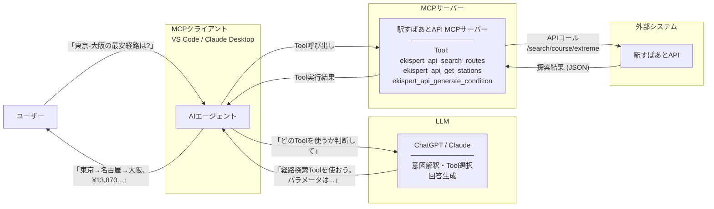
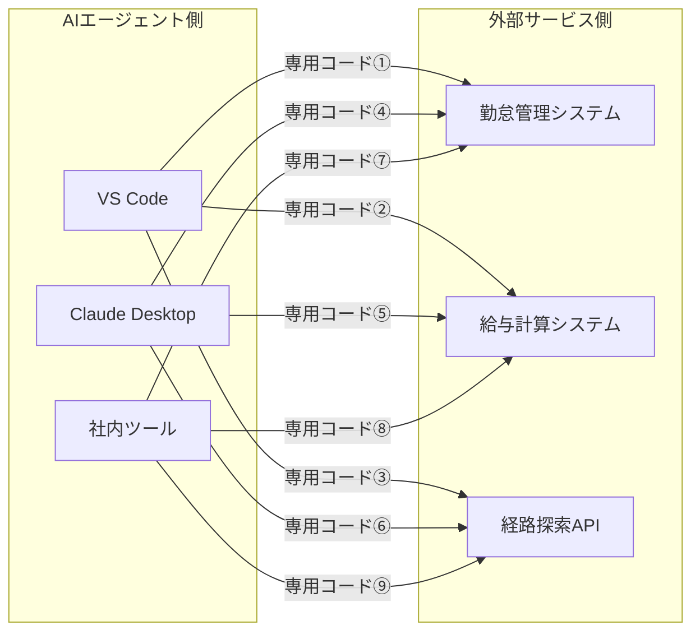
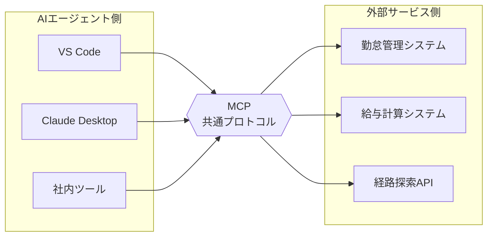
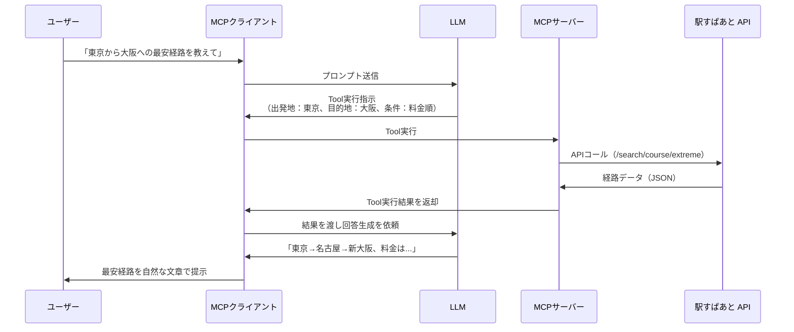
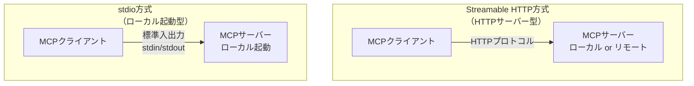

# 2. MCPサーバーとは

> **所要時間**: 20分

## このセクションの目的

このセクションでは、以下の内容を理解します。

- MCP（Model Context Protocol）の定義と必要性を理解する
- MCPサーバーとMCPクライアントの関係を理解する
- MCP登場によって「何がどう変わったか」を理解する
- 実際のMCPサーバーの活用例を知る

---

## 2-1. MCP（Model Context Protocol）とは

### AIエージェントは「頭はいいが、外の世界とつながりにくかった」

AIエージェントは、ユーザーの指示を理解して自律的に行動できます。しかし、**外部のシステムと連携するには、アプリケーション側が個別に連携コードを開発する必要がありました**。

たとえば、「来週の月曜日の東京の天気を調べてスケジュールを調整して」というタスクをこなすには、AIエージェントが天気予報サービスにアクセスする仕組みを、アプリケーション側が事前に実装しておく必要があったのです。

> 💡 **AIエージェント自体は賢くなった。しかし「どの外部システムと、どうやって連携するか」は、アプリケーションごとに個別対応が必要だった。**

AIエージェントが本当に役立つためには、データベース、WebAPI、ファイルシステムといった外部システムと連携する仕組みが不可欠です。そのための「共通言語」として登場したのが、**MCP（Model Context Protocol）** です。

### MCPとは何か

**MCP（Model Context Protocol）** は、AIエージェントと外部システムを繋ぐための**オープンソースの標準プロトコル**です。

2024年11月にAnthropic社が提唱し、オープンソースとして公開されました。現在では、Claude Desktop、VS Code（GitHub Copilot）をはじめ、多くのAIエージェントがMCPに対応しています。

---

## 2-2. MCP登場で「何がどう変わったか」

ここが、このセクション最大のポイントです。

MCP登場以前も、AIエージェントと外部システムを繋ぐこと自体は**技術的には可能**でした。では、何が問題だったのでしょうか。そして、MCPによって何が変わったのでしょうか。

### MCP普及前：n × m の組み合わせ爆発

MCP登場以前、AIエージェントから外部システムを利用するには、**それぞれのアプリケーション側が、それぞれのサービスに合わせた連携コードを個別に開発する**必要がありました。

勤怠管理システム・給与計算システム・経路探索APIという3つのサービスと連携しようとすると...

**3アプリ × 3サービス = 9本の専用コードが必要**です。これがアプリ10個、サービス10個になれば、**100本**。アプリやサービスが増えるほど、この数は比例して膨れ上がります。

しかも、各サービスのAPIが更新されるたびに、連携しているすべてのアプリ側も修正が必要です。どこかが壊れても、原因の特定が困難でした。

> 💡 **一昔前、デバイスによって規格が異なり、充電のために複数のケーブルが必要だった時代と似たような不便さだ。**

### MCPの登場後：n + m のシンプルな世界

MCPによって、構造が根本から変わります。

- **外部サービス側**：サービスごとにMCPサーバーを実装
- **AIエージェント側**：MCPに対応していれば、あらゆるMCPサーバーを利用できる

**3アプリ + 3サービス = 6つの実装で済む**のです。新しいサービスが加わっても、MCPサーバーを1つ作れば、既存のすべてのアプリから即座に使えるようになります。

> 💡 **USB-Cが登場した時、ケーブル1本でPCもスマホも充電できるようになった。MCPは、AI連携の世界でその役割を果たしている。**

### 整理：MCPの普及で何が変わったか

| 比較項目 | MCP普及前 | MCP登場後 |
|---|---|---|
| **開発コスト** | アプリ数 × サービス数（n × m） | アプリ数 + サービス数（n + m） |
| **開発主体** | アプリ側が各サービスに合わせて個別開発 | サービス提供側がMCPサーバーを実装 |
| **学習コスト** | サービスごとに仕様を調査・習得 | 統一された方法で設定するだけで利用可 |
| **メンテナンス** | API変更のたびに複数箇所を修正 | MCPサーバーのみ修正すればよい |
| **知見の共有** | 連携コードはアプリ固有で使い回せない | MCPサーバーのコミュニティでの公開・共有 |
| **セキュリティ** | 各アプリがバラバラに実装し、品質にばらつき | 認証・認可の仕組みやセキュリティ対策の標準化 |

> 💡 MCPにより、AIエージェントは個別の実装なしに多様な外部システムへアクセスしやすくなりました。 MCPのコミュニティの活用で機能を素早く拡張でき、連携できるシステムの幅が大きく広がっています。
---

## 2-3. MCPの構成要素

MCPは、**MCPクライアント**と**MCPサーバー**という2つの要素で構成されます。

### MCPクライアントとは

**MCPクライアント**は、ユーザーが操作するAIエージェント側のアプリケーションです。ユーザーの指示を受け取り、LLMと連携しながら、必要に応じてMCPサーバーを呼び出します。

主なMCPクライアントの例は以下のとおりです。

- **VS Code + GitHub Copilot**：Microsoft社のコードエディタとAIコーディング支援機能
- **Claude Desktop**：Anthropic社が提供するデスクトップアプリケーション

### MCPサーバーとは

**MCPサーバー**は、外部システムへの「橋渡し役」です。MCPクライアントからの指示を受け取り、データベースやWebAPIにアクセスして結果を返します。

#### MCPサーバーが提供する機能

MCPサーバーは、以下の3種類の機能をMCPクライアントに提供できます。

| 機能 | 説明 | 例 |
|---|---|---|
| **Tool** | AIエージェントが実行できるアクション。パラメータを受け取り処理を実行し、結果を返す | ・ファイルを読み込むTool ・データベースにクエリを実行するTool ・経路を検索するTool |
| **Resource** | AIエージェントが参照できるデータ。読み取り専用の情報 | ・プロジェクト内のファイル一覧 ・データベースのテーブル定義 ・APIのドキュメント |
| **Prompt** | よく使う指示テンプレート。あらかじめ定義された質問や指示パターン | ・「このコードをレビューして」 ・「このデータを分析して」 |

> 💡 **多くのMCPサーバーは主に「Tool」を提供する。「駅すぱあと API MCPサーバー」も経路探索などのToolを提供している。**

### MCPクライアントとMCPサーバーの関係

ユーザーが「東京から大阪への最安経路を教えて」と入力したとき、内部では以下のような処理が行われています。

ポイントは、**ユーザーはMCPの仕組みを一切意識しなくてよい**という点です。普通に話しかけるだけで、裏側ではAPIが呼び出され、結果が整形されて返ってきます。

---

## 2-4. MCPの通信方式

MCPサーバーとMCPクライアント間の通信には、大きく分けて2つの方式があります。

| 項目 | stdio方式 | Streamable HTTP方式 |
|---|---|---|
| **概要** | 標準入出力を使った通信方式 | HTTPプロトコルを使った通信方式 |
| **動作場所** | 自分のコンピューター上（ローカル） | ローカルまたはリモート（インターネット上） |
| **起動方法** | Dockerやnpxなどでローカル起動 | HTTPサーバーとして起動 |
| **プロセス管理** | MCPクライアントが自動的に起動・管理 | 独立したHTTPサーバーとして動作 |
| **認証** | 不要（ローカル実行のため） | APIキーやトークンによる認証が必要 |
| **適した用途** | ・ローカルファイルへのアクセス ・ローカルコマンドの実行 ・開発・テスト環境での利用 | ・WebAPIとの連携 ・リモートシステムへのアクセス ・複数ユーザーでの共有利用 |

「駅すぱあと API MCPサーバー」は、**Streamable HTTP方式**で動作します。

---

## 2-5. MCPサーバーの活用例

実際にどのようなMCPサーバーが存在し、どのように活用されているかを見ていきましょう。

### 公式MCPサーバー（Anthropic社提供）

#### Filesystem

**機能**：ローカルファイルシステムへのアクセス
**提供するTool**：
- ファイルの読み込み
- ファイルの書き込み
- ファイル一覧の取得
- ディレクトリ作成

**活用例**：
- 「このフォルダ内のすべてのPythonファイルを読み込んで、エラーがないか確認して」
- 「売上データCSVを整形して、新しいファイルに保存して」

#### Fetch

**機能**：WebサイトやWebAPIへのアクセス

**提供するTool**：
- 指定したURLからコンテンツを取得
- HTTPリクエストの送信

**活用例**：
- 「この会社のWebサイトから最新のプレスリリースを取得して」
- 「天気予報APIから今日の天気を取得して」

#### Time

**機能**: 現在時刻の取得とタイムゾーン変換

**提供するTool**：
- 現在時刻の取得
- タイムゾーン変換

**活用例**：
- 「ニューヨークの現在時刻を教えて」
- 「日本時間の15時は、ロンドンでは何時？」

#### GitHub

**機能**：GitHubリポジトリへのアクセス

**活用例**：
- 「このリポジトリのREADMEを読んで、セットアップ手順を日本語で説明して」
- 「バグ報告のIssueを作成して。再現手順と環境情報も含めて」

#### その他の公式MCPサーバー

- **Memory**：AIエージェントが情報を記憶・検索
- **Brave Search**：Web検索
- **Google Drive**：Google Driveへのアクセス
- **Slack**：Slackメッセージの送受信
- **PostgreSQL**：PostgreSQLデータベースへのアクセス

### コミュニティが開発したMCPサーバー

MCPはオープンソースのため、世界中の開発者がMCPサーバーを作成・公開しています。

- **Notion MCPサーバー**：Notionデータベースへのアクセス
- **Jira MCPサーバー**：Jiraのチケット管理
- **Spotify MCPサーバー**：音楽の再生・検索
- **AWS管理用MCPサーバー**：AWSリソースの操作・監視

> 💡 **MCPサーバーの一覧は、以下のリポジトリで確認できます：**
> https://github.com/modelcontextprotocol/servers

### 「駅すぱあと API MCPサーバー」の位置づけ

このハンズオンで実際に使う **「駅すぱあと API MCPサーバー」** は、「駅すぱあと API」をMCPクライアントから自然言語で呼び出せるようにするMCPサーバーです。

**提供する主なTool**：
- **経路探索**：出発地から目的地までの経路を検索
- **駅情報取得**：駅の詳細情報を取得
- **探索条件生成**：細かい条件を指定した経路探索

**特徴**：
- Streamable HTTP方式で動作
- 「駅すぱあと API」のアクセスキーで認証
- 日本の公共交通機関に特化した高精度な経路探索

**活用シーン**：
- 「東京駅から大阪駅までの最安経路を教えて」
- 「明日の朝8時に新宿駅に着くには、横浜駅を何時に出発すればいい？」
- 「新幹線を使わずに、東京から京都まで行く方法を教えて」

このハンズオンでは、この「駅すぱあと API MCPサーバー」を実際に使いながら、MCPサーバーの仕組みを体験していきます。

### MCPサーバー利用時の注意点

MCPサーバーは外部システムと連携する便利なツールですが、**業務で活用する際にはセキュリティリスクを十分に考慮する必要があります**。

このハンズオンでは時間の都合上、セキュリティの詳細には触れませんが、実際の業務でMCPサーバーを導入する際には、適切なセキュリティ対策が不可欠です。

**詳しくは、[付録：MCPサーバーのセキュリティガイド](appendix/mcp_security.md)を参照してください。**

業務での利用を検討される方は、必ず付録の内容を確認されることをお勧めします。

---

次のセクションからは、実際にMCPサーバーを動かしながら、その仕組みを体験していきます。

---

[← 前へ：生成AI時代とAIエージェントの基礎](01_ai_agent_basics.md) | [目次](../README.md) | [次へ：MCPサーバーを触ってみよう →](03_mcp_handson.md)
